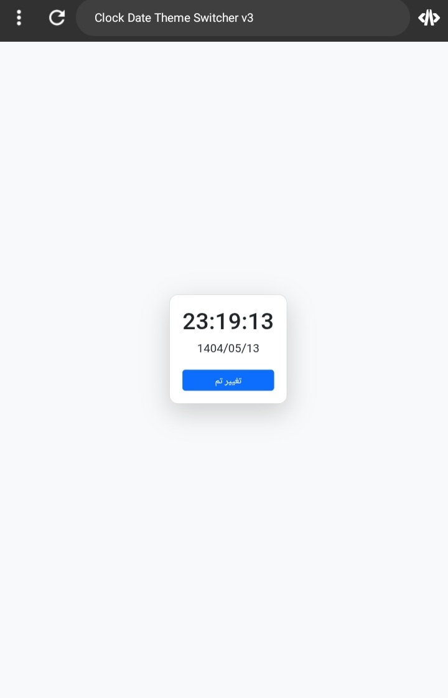

# ⏰ Clock, Date & Theme Switcher - V3

**English | فارسی**

---

## 📌 Description | توضیحات پروژه

🔹 A simple web application that displays the real-time clock, Jalali (Persian) date, and allows switching between light and dark themes using JavaScript and Bootstrap.

🔹 یک وب‌اپلیکیشن ساده که ساعت لحظه‌ای، تاریخ شمسی و دکمه‌ی تغییر تم روشن/تاریک را با جاوااسکریپت و بوت‌استرپ نمایش می‌دهد.

---

## ⚙️ Features | امکانات

- ✅ Real-time digital clock  
- ✅ Jalali (Persian) date converter  
- ✅ Light/Dark theme toggle with `localStorage`  
- ✅ Responsive design using Bootstrap  
- ✅ Separate HTML, CSS, and JS files

---

## 💻 Technologies Used | تکنولوژی‌ها

- HTML5  
- CSS3 + Bootstrap  
- JavaScript (Vanilla)

---

## 🖼️ Preview | پیش‌نمایش

---

## 📝 Author | نویسنده

**Farhad Akbary**  
Front-end Developer in Progress 👨‍💻  
GitHub: [@yourusername](https://github.com/fathad-dev84)

---
